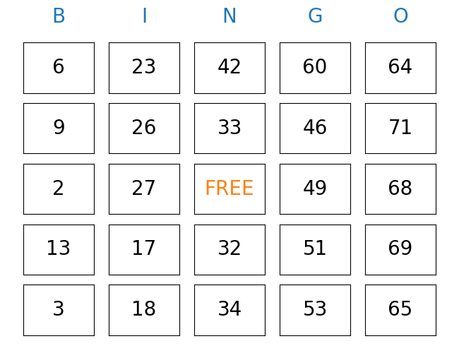

# bingo
Make a bingo board for playing the bingo game

A Bingo game utilizes the numbers 1 through 75. 
The five columns of the card are labeled 'B', 'I', 'N', 'G', and 'O' from left to right. 
The center space is usually marked "Free", and is considered automatically filled. 
The range of printed numbers that can appear on the card is normally restricted by column, 
with the 'B' column only containing numbers between 1 and 15 inclusive,
the 'I' column containing only 16 through 30, 'N' containing 31 through 45,
'G' containing 46 through 60, and 'O' containing 61 through 75.

